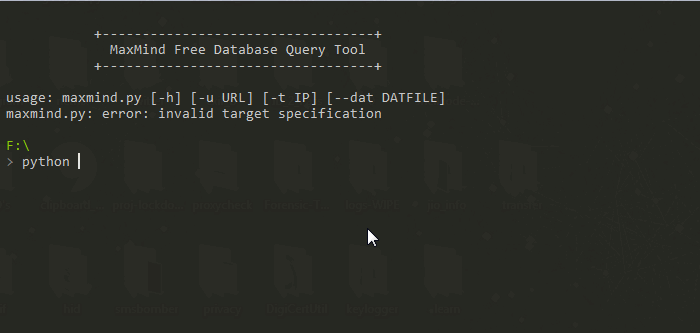

#IPTrace
IPTrace a python script which uses maxmind free database to acquire location information.

`What is MaxMind ?`
> MaxMind is a Massachusetts-based digital mapping company that provides location data for IP addresses in the United States, provides service to Feds

#### i.e: roothaxor.in Information
City: San Francisco region_code: CA area_code: 415 time_zone: America/Los_Angeles dma_code: 807 metro_code: San Francisco, CA 
country_code3: USA latitude: 37.7697 postal_code: 94107 
longitude: -122.3933 country_code: US country_name: United States 

### In Work! 
> 
